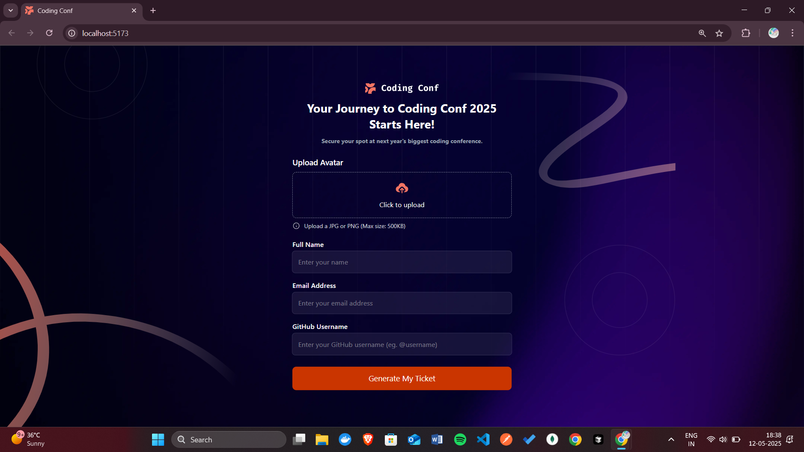
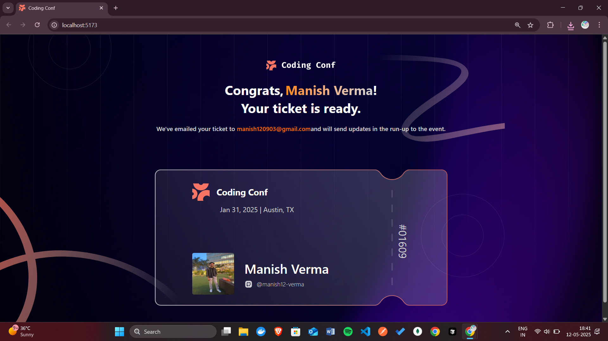

#  Coding Conf Ticket Generator

Coding Conf 2025 Ticket Generator is a sleek React-based web app that lets users register for the event and instantly create a personalized digital ticket. Just upload your avatar, enter your name, email, and GitHub handle — and watch your custom-styled ticket come to life in real time. Built for a smooth, interactive experience, it's the perfect way to showcase your spot at the conference!

##  Demo

Live Demo —  https://ticket-generator-ten-rouge.vercel.app/

---

##  Preview

- Register Page

  

- Ticket Page

  

---

##  Features

-  Upload your avatar (JPG/PNG under 500KB)
-  Input and validate user details (name, email, GitHub)
-  Automatically generate a stylized digital ticket
-  Responsive layout for mobile and desktop
-  Confirmation message showing email acknowledgment

---

## Tech Stack

- **React 18+**
- **Tailwind CSS** for styling
- **Custom assets** for visual elements

---

##  Installation Guide

Follow these steps to set up the frontend application locally:

### Prerequisites

- Ensure you have **Node.js** (v16 or higher) installed. You can download it from [Node.js Official Website](https://nodejs.org/).
- Install a package manager like **npm** (comes with Node.js) or **yarn**.

## Steps to Install and Run

1. **Clone the Repository**

   Clone the repository to your local machine using the following command:

   ```bash
   git clone https://github.com/your-username/wasserstoff-task2.git
   cd wasserstoff-task2
   ```
2. **Install Dependencies**
   
    Install all the required dependencies for the project:

    ```bash
    npm install
    ```
2. **Start the Development Server**
   
    Install all the required dependencies for the project:

    ```bash
    npm run dev
    ```
    
   The application will be available at http://localhost:5173.

##  Contribution

Contributions are always welcome! If you'd like to contribute to this project, follow these steps:

1. **Fork the Repository**  
   Click the "Fork" button at the top-right corner of this repository to create your own copy.

2. **Clone Your Fork**  
   Clone your forked repository to your local machine:

   ```bash
   git clone https://github.com/your-username/wasserstoff-task2.git
   cd wasserstoff-task2
   ```

3. **Create a New Branch**  
   Create a new branch for your feature or bug fix:

   ```bash
   git checkout -b feature-name
   ```

4. **Make Changes**  
   Make your changes and commit them with a meaningful commit message:

   ```bash
   git add .
   git commit -m "Add a meaningful commit message"
   ```

5. **Push Changes**  
   Push your changes to your forked repository:

   ```bash
   git push origin feature-name
   ```

6. **Open a Pull Request**  
   Go to the original repository on GitHub and open a pull request from your forked repository.

---

###  Guidelines

- Ensure your code follows the project's coding standards.
- Write clear and concise commit messages.
- Test your changes thoroughly before submitting a pull request.
- If you're adding a new feature, update the documentation accordingly.

Thank you for contributing!
